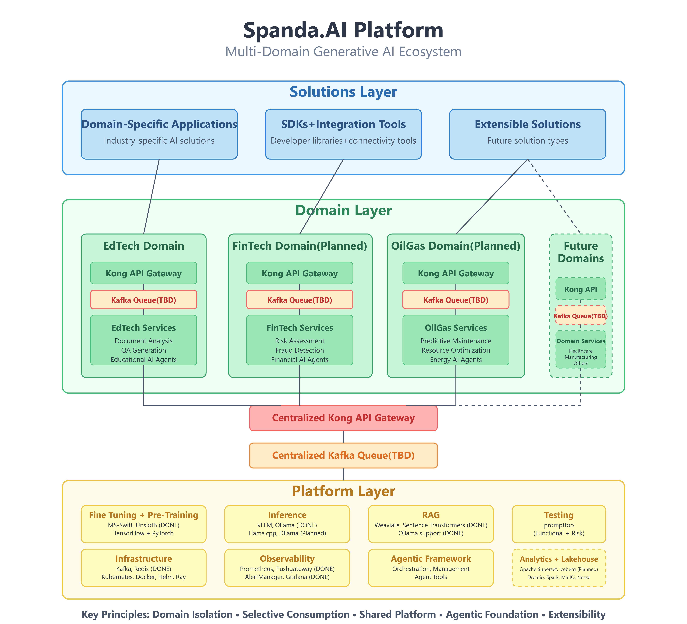

# SpandaAI Platform: Detailed Component Overview and Domain Capabilities

The SpandaAI Platform is a cutting-edge Generative AI (GenAI) ecosystem designed to support multiple domains such as FinTech, Healthcare, and EdTech. The platform leverages a modular, 3-layer architecture to ensure scalability, flexibility, and seamless integration of GenAI capabilities.

This repository houses the core components of the SpandaAI ecosystem, including foundational services, domain-specific functionalities, and solutions tailored for end-users.

---

## Table of Contents

1. [Introduction](#introduction)
2. [Platform Architecture Overview](#platform-architecture-overview)
   - [Platform Layer Components](#platform-layer-components)
3. [Overall Architecture Diagram](#overall-architecture-diagram)
4. [SpandaAI Platform Layer Components](#spandaai-platform-layer-components)
   - [1. Fine Tuning + Pre-Training](#1-fine-tuning--pre-training)
   - [2. Inference](#2-inference)
   - [3. RAG (Retrieval Augmented Generation)](#3-rag-retrieval-augmented-generation)
   - [4. Testing](#4-testing)
   - [5. Infrastructure](#5-infrastructure)
   - [6. Observability](#6-observability)
   - [7. Agentic Framework](#7-agentic-framework)
   - [8. Analytics/Lakehouse (Planned)](#8-analyticslakehouse-planned)
5. [Deployment Architecture](#deployment-architecture)
6. [Domain Layer Overview](#domain-layer-overview)
    - [EdTech Domain Detailed Breakdown](#edtech-domain-detailed-breakdown)
    - [Shared Components Across Domains](#shared-components-across-domains)
7. [Multi-Domain Capabilities](#multi-domain-capabilities)
8. [Support](#support)
9. [License](#license)
---

## Introduction

The SpandaAI Platform is a state-of-the-art GenAI ecosystem developed to serve diverse industries. Its modular 3-layered architecture facilitates rapid deployment of domain-specific functionalities while ensuring robust foundational services. This design not only empowers industries like FinTech, Healthcare, and Oil and Gas but also provides specialized support for educational technology (EdTech) with reusable shared components.

---

## Platform Architecture Overview

The platform is organized into two primary areas: the **Platform Layer** (core infrastructure and services) and the **Domain Layer** (industry-specific logic and capabilities).

### Platform Layer Components

The `platform` directory is structured as follows:

- **data_management**  
  Responsible for managing data storage, retrieval, and processing. This component handles databases, caching mechanisms, and data pipelines that feed into AI models.

- **fine-tuning_and_training**  
  Provides the infrastructure for training and fine-tuning AI models. It includes scripts, configurations, and resources needed to adjust models with domain-specific datasets.

- **gateway**  
  Acts as the primary interface for incoming requests. It routes external API calls to the appropriate internal services and manages authentication, load balancing, and other middleware functions.

- **inference**  
  Manages the model serving and inference processes. This component is optimized for real-time prediction, ensuring that responses from AI models are delivered efficiently to client applications.

- **infrastructure**  
  Contains the configuration and scripts related to the provisioning of compute resources and cloud infrastructure. This includes container orchestration (e.g., Kubernetes) and other core infrastructure services.

- **observability**  
  Implements monitoring and logging solutions to track system performance, detect anomalies, and ensure overall health of the platform. Tools like Prometheus and Dockprom are integrated here.

- **RAG (Retrieval Augmented Generation)**  
  Enhances the generative capabilities of the platform by integrating retrieval mechanisms. This module retrieves contextually relevant data to improve the quality and relevance of AI-generated content.

- **testing**  
  Houses automated tests and quality assurance scripts that ensure the stability and reliability of the platform components. This is crucial for continuous integration and delivery pipelines.

- **init.py, quickstart.bat, quickstart.sh, readme.MD**  
  These files provide initialization routines, quick-start scripts for different operating systems, and introductory documentation to help developers understand the platform's structure.

# SpandaAI Platform: Detailed Overview of the Platform Layer

This section provides a concise yet comprehensive overview of the Platform Layer components within the SpandaAI ecosystem. The Platform Layer is the backbone of the system, providing essential services and infrastructure that power the overall GenAI operations. It integrates seamlessly with both the Domain and Solutions layers, with Kafka queues ensuring scalable and decoupled communication across all layers. Additionally, all components connect via a Kong API Gateway for unified external interfacing.

---
## Overall Architecture Diagram

Below is a simplified architectural diagram illustrating the separation of layers and key components:

---
# SpandaAI Platform Layer Components

## 1. Fine Tuning + Pre-Training

**Purpose**: Train and customize AI models for specific domains and use cases.

| Component | Status | Description |
|-----------|--------|-------------|
| **MS-Swift** | DONE | Microsoft's framework for efficient fine-tuning of large language models. Advanced model fine-tuning/pre-training engine. |
| **Unsloth** | DONE | Optimization library for faster training and fine-tuning of LLMs. Provides robust training pipelines designed for efficient model adjustments. |
| **TensorFlow** | Implemented | Open-source machine learning framework. |
| **PyTorch** | Implemented | Deep learning framework with strong GPU acceleration. |

**Integration Points**: Provides trained models to the Inference component.

## 2. Inference

**Purpose**: Efficient model execution and prediction generation.

| Component | Status | Description |
|-----------|--------|-------------|
| **vLLM** | DONE | High-throughput and memory-efficient inference engine for LLMs. Optimized for speed in production environments. |
| **Ollama** | DONE | Local LLM running framework with model management. Production-ready LLM serving platform. |
| **Llama.cpp** | PLANNED | Lightweight C++ implementation for LLM inference. Will provide CPU-only inference solutions for lightweight deployment. |
| **Dllama** | PLANNED | Distributed Llama implementation for scaled inference. Will extend the capabilities of Llama.cpp with distributed computing features for scalability. |

**Integration Points**: Interfaces with domain-specific services and RAG components.

## 3. RAG (Retrieval Augmented Generation)

**Purpose**: Enhance LLM responses with retrieved relevant information.

| Component | Status | Description |
|-----------|--------|-------------|
| **Weaviate** | DONE | Vector database for semantic search operations. Provides vector search engine for contextually relevant data retrieval. |
| **Sentence Transformers** | DONE | Framework for generating text embeddings. Used to create high-quality embeddings for semantic search. |
| **Ollama Support** | DONE | Integration with Ollama for unified retrieval workflows. Extended to serve embedding models for RAG applications. |

**Integration Points**: Connects to inference engines and domain knowledge bases.

## 4. Testing

**Purpose**: Validation and quality assurance of AI models and systems.

| Component | Status | Description |
|-----------|--------|-------------|
| **Promptfoo Functional Testing** | DONE | Validates core functionality of AI systems using promptfoo. |
| **Promptfoo Risk Assessment** | DONE | Identifies safety, reliability, and ethical breaches using promptfoo. |
| **Predator Non-Functional Testing** | Planned | Ensures safety, reliability, and ethical constraints using promptfoo. |
| **LLM Guardrails** | Planned | Ensures safety, reliability, and ethical constraints using promptfoo. |

**Integration Points**: Validates outputs across all platform layers.

## 5. Infrastructure

**Purpose**: Core operational systems supporting the platform.

| Component | Status | Description |
|-----------|--------|-------------|
| **Kafka** | Supported by components | Distributed event streaming platform. Central messaging system ensuring decoupled and scalable communication. |
| **Redis** | Supported by components | In-memory data structure store for caching and messaging. High-performance data store for caching and quick data access. |
| **Kubernetes** | Supported by components | Container orchestration for scalable deployments. Orchestration platform for containerized services. |
| **Docker** | Supported by components | Containerization technology. Provides consistent deployment across environments. |
| **Helm** | Supported by components | Kubernetes package manager. Streamlines deployment and management of Kubernetes applications. |
| **Ray** | Supported by components | Framework for distributed and parallel computing. Enables scalable model serving and parallel processing. |

**Integration Points**: Provides operational foundation for all other components.

## 6. Observability

**Purpose**: Monitoring, logging, and diagnostics.

| Component | Status | Description |
|-----------|--------|-------------|
| **Prometheus** | DONE | Metrics collection and monitoring. Acts as a metrics database for real-time monitoring. |
| **Pushgateway** | DONE | Push-based metrics collection. Acts as push acceptor for ephemeral and batch jobs. |
| **AlertManager** | DONE | Alert handling and notification routing. Manages system notifications. |
| **Grafana** | DONE | Visualization and dashboarding. Provides visualization tools for metrics. |
| **NodeExporter** | DONE | Host-level metrics collector. Gathers system-level metrics from servers. |
| **cAdvisor** | DONE | Container metrics collector. Gathers performance data from containers. |
| **Caddy** | DONE | Reverse proxy. Provides reverse proxy and basic auth for Prometheus and AlertManager. |

**Integration Points**: Monitors all platform services and components.

## 7. Agentic Framework

**Purpose**: Manage AI agents across domains.

| Component | Status | Description |
|-----------|--------|-------------|
| **Orchestration** | Planned | Coordination of multiple AI agents. |
| **Management** | Planned | Lifecycle and state management for agents. |
| **Agent Tools** | Planned | Capabilities and functions available to AI agents. |

**Integration Points**: Connects with domain-specific agent implementations.

## 8. Analytics/Lakehouse (Planned)

**Purpose**: Data storage, analysis, and intelligence.

| Component | Status | Description |
|-----------|--------|-------------|
| **Apache Superset** | Planned | Business intelligence web application. |
| **Iceberg** | Planned | Table format for large analytical datasets. |
| **Dremio** | Planned | Data lake engine. |
| **Spark** | Planned | Analytics engine for large-scale data processing. |
| **MinIO** | Planned | High-performance object storage. |
| **Nesse** | Planned | Data processing framework. |

**Integration Points**: Will provide analytical capabilities across the platform.

## Deployment Architecture

The SpandaAI Platform Layer is designed for Kubernetes-based deployment with the following considerations:

1. **Containerization**: All components are containerized using Docker for consistent deployment.
2. **Orchestration**: Kubernetes manages the lifecycle and scaling of all platform components.
3. **Package Management**: Helm charts provide standardized deployment templates.
4. **Distributed Computing**: Ray enables efficient resource allocation for ML workloads.
5. **Messaging**: Kafka ensures reliable communication between components.
6. **Caching and State**: Redis provides high-performance data access and state management.

---

## Domain Layer Overview

The **Domain Layer** encapsulates the business logic and specialized functionalities tailored for various industries. Although the platform is designed to support multiple domains, the following breakdown focuses on the EdTech domain as an exemplary case.

### EdTech Domain Detailed Breakdown

Within the `domains\EdTech` directory, the components are organized to address the specific challenges and requirements of educational technology:

- **api_gateway**  
  Manages the API endpoints specific to the EdTech domain, handling requests related to educational content, user interactions, and third-party integrations.

- **data_preprocessing**  
  Contains scripts and utilities to clean, transform, and prepare educational datasets for analysis and training. This is essential for ensuring that raw data is suitable for AI model consumption.

- **document_analysis**  
  Focuses on the analysis of educational documents, such as textbooks, research papers, and course materials. It includes features for extracting key information, summarization, and semantic analysis.

- **document_similarity**  
  Implements algorithms to determine the similarity between documents. This can be used for plagiarism detection, content recommendation, and clustering of educational materials.

- **edu_ai_agents**  
  Deploys AI agents designed to interact within educational environments. These agents can assist in tutoring, answer student queries, and provide personalized learning experiences.

- **face_analysis**  
  Provides facial recognition and emotion detection functionalities, which can be applied to enhance user engagement and monitor classroom interactions.

- **qa_generation**  
  Automates the generation of questions and answers from educational content. This supports the creation of quizzes, assessments, and interactive learning modules.

- **training**  
  Contains resources and scripts dedicated to training the EdTech-specific AI models. This component is integral for continuously updating and refining the models based on new educational data.

- **Configuration and Environment Files**  
  - **.env, env.example**: Environment configuration files that store sensitive settings and parameters.
  - **docker-compose.yml**: Orchestrates containerized services for the EdTech domain.
  - **Dockerfiles (e.g., Dockerfile.data_preprocessing, Dockerfile.document_analysis, etc.)**: Define the build processes for various services in the EdTech domain.
  - **setup.py**: Handles the packaging and installation of the domain-specific modules.
  - **start_edtech_domain.bat, start_edtech_domain.sh**: Scripts to initialize the EdTech domain services.

### Shared Components Across Domains

The EdTech domain includes components which can be used across various domains with minor modifications.

---

## Multi-Domain Capabilities

Beyond the EdTech domain, the SpandaAI Platform is designed to support a wide variety of sectors, including but not limited to:

- **FinTech:**  
  Tailored for financial services with modules for risk assessment, fraud detection, and automated financial advisory.

- **Healthcare:**  
  Includes specialized components for medical imaging, patient data analysis, and predictive diagnostics.

- **Oil and Gas:**  
  Provides solutions for predictive maintenance, resource optimization, and operational efficiency in energy production.

- **Other Industries:**  
  The platform’s modular design means it can be adapted to meet the unique challenges of nearly any sector. With the ability to plug in domain-specific models and shared services, SpandaAI is poised to handle a broad spectrum of use cases.

---

## Support

For assistance or to report issues, please contact the SpandaAI support team or submit a ticket in the [issue tracker](https://github.com/spandaai/spandaai-platform/issues).

---

## License

This project is licensed under the MIT License. See the `LICENSE` file for details.