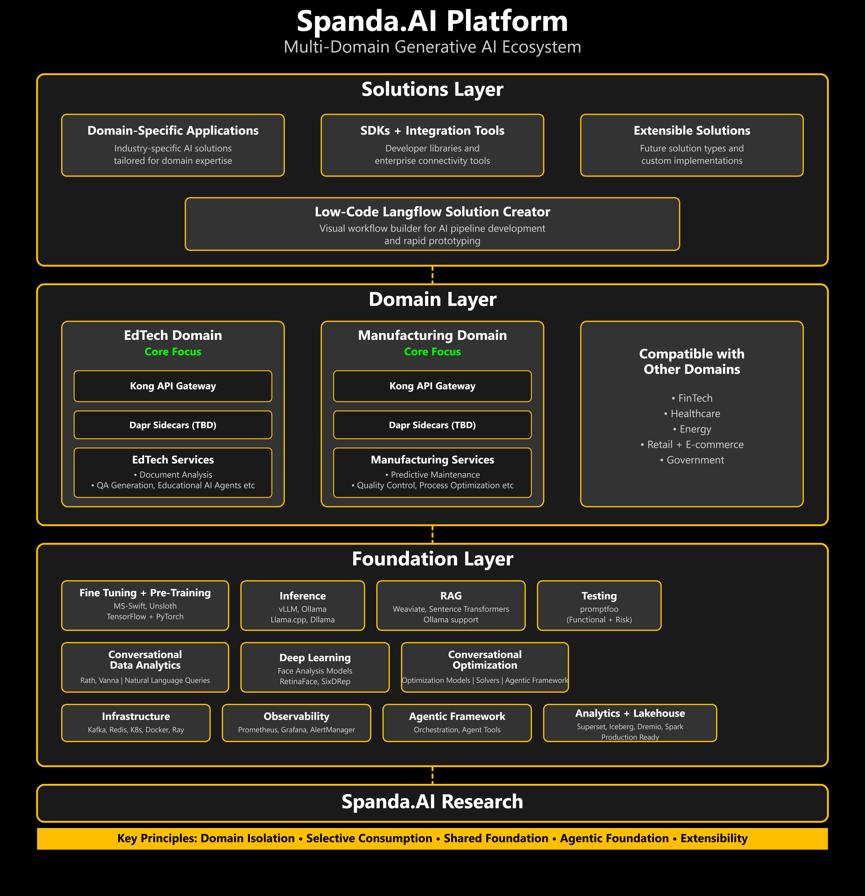

# SpandaAI Platform: Detailed Component Overview and Domain Capabilities

The SpandaAI Platform is a cutting-edge Generative AI (GenAI) ecosystem designed to support multiple domains such as FinTech, Healthcare, and EdTech. The platform leverages a modular, 3-layer architecture to ensure scalability, flexibility, and seamless integration of GenAI capabilities.

This repository houses the core components of the SpandaAI ecosystem, including foundational services, domain-specific functionalities, and solutions tailored for end-users.

---

## Table of Contents

1. [Introduction](#introduction)
2. [Platform Architecture Overview](#platform-architecture-overview)
   - [Platform Layer Components](#platform-layer-components)
3. [Overall Architecture Diagram](#overall-architecture-diagram)
4. [SpandaAI Platform Layer Components](#spandaai-platform-layer-components)
   - [1. Fine Tuning + Pre-Training](#1-fine-tuning--pre-training)
   - [2. Inference](#2-inference)
   - [3. RAG (Retrieval Augmented Generation)](#3-rag-retrieval-augmented-generation)
   - [4. Testing](#4-testing)
   - [5. Infrastructure](#5-infrastructure)
   - [6. Observability](#6-observability)
   - [7. Agentic Framework](#7-agentic-framework)
   - [8. Analytics/Lakehouse (Planned)](#8-analyticslakehouse-planned)
5. [Deployment Architecture](#deployment-architecture)
6. [Domain Layer Overview](#domain-layer-overview)
    - [EdTech Domain Detailed Breakdown](#edtech-domain-detailed-breakdown)
    - [Shared Components Across Domains](#shared-components-across-domains)
7. [Multi-Domain Capabilities](#multi-domain-capabilities)
8. [Support](#support)
9. [License](#license)
---

## Introduction

The SpandaAI Platform is a state-of-the-art GenAI ecosystem developed to serve diverse industries. Its modular 3-layered architecture facilitates rapid deployment of domain-specific functionalities while ensuring robust foundational services. This design not only empowers industries like FinTech, Healthcare, and Oil and Gas but also provides specialized support for educational technology (EdTech) with reusable shared components.

---

## Platform Architecture Overview

The platform is organized into two primary areas: the **Platform Layer** (core infrastructure and services) and the **Domain Layer** (industry-specific logic and capabilities).

This section provides a concise yet comprehensive overview of the Platform Layer components within the SpandaAI ecosystem. The Platform Layer is the backbone of the system, providing essential services and infrastructure that power the overall GenAI operations. 

---
## Overall Architecture Diagram

Below is a simplified architectural diagram illustrating the separation of layers and key components:

---
# SpandaAI Platform Layer Components

## 1. Fine Tuning + Pre-Training

**Purpose**: Train and customize AI models for specific domains and use cases.

## Training Methods Plan

| Training Method                          | Description | Status |
|------------------------------------------|-------------|------------|
| **Decentralized Training**           | In decentralized training, multiple nodes independently train models using their local data and periodically exchange updates with each other to improve performance. This approach eliminates the need for a central server, enabling training to be more robust to failures and reducing communication overhead. It is ideal for scenarios where data privacy is a concern, and computing resources are distributed across multiple devices or edge nodes. |  Planned ⏱️  |
**Federated Learning** | Federated learning involves multiple client devices that locally train models on their own data and then share only the model updates (gradients) with a central server, rather than raw data. This method enhances data privacy and security while still allowing collaborative model training. It is commonly used in environments where data cannot be centralized, such as healthcare and mobile applications.|  Planned ⏱️  |

### Supported Training Methods:

DeepSpeed is supported, thus multi-node is supported aswell. Please look at the fine-tune_and_train dir for more details.

| Training Approach       | Full-Tuning ✅ | Freeze-Tuning ✅ | LoRA ✅ | QLoRA ✅ |
|------------------------|---------------|---------------|---------|---------|
| **Pre-Training**       | ✅             | ✅             | ✅       | ✅       |
| **Supervised Fine-Tuning** | ✅        | ✅             | ✅       | ✅       |
| **Reward Modeling**    | ✅             | ✅             | ✅       | ✅       |
| **PPO Training**       | ✅             | ✅             | ✅       | ✅       |
| **DPO Training**       | ✅             | ✅             | ✅       | ✅       |
| **KTO Training**       | ✅             | ✅             | ✅       | ✅       |
| **ORPO Training**      | ✅             | ✅             | ✅       | ✅       |
| **SimPO Training**     | ✅             | ✅             | ✅       | ✅       |

**Integration Points**: Provides trained models to the Inference component.

## 2. Inference

**Purpose**: Efficient model execution and prediction generation.

| **Feature** | **Details** |
|------------|-----------|
| **Performance Features** | |
| ✅ Serving Throughput | State-of-the-art serving throughput |
| ✅ Memory Management | PagedAttention for efficient key/value memory management |
| ✅ Batching | Continuous batching of incoming requests |
| ✅ Model Execution | CUDA/HIP graph for fast execution |
| ✅ Quantization Support | GPTQ, AWQ, INT4, INT8, FP8 |
| ✅ Optimized Kernels | Integration with FlashAttention and FlashInfer |
| ✅ Speculative Decoding | Yes. Planned integrations for massive performance boost. |
| ✅ Chunked Prefill | Yes |
| ✅ Performance Benchmarking | Benchmarks vs. TensorRT-LLM, SGLang, and LMDeploy |
| **Ease of Use & Flexibility** | |
| ✅ Hugging Face Integration | Seamless support for popular Hugging Face models |
| ✅ Decoding Algorithms | Parallel sampling, beam search, and more |
| ✅ Distributed Inference | Supports tensor parallelism and pipeline parallelism |
| ✅ Streaming Outputs | Yes |
| ✅ OpenAI API Compatibility | Yes |
| ✅ Prefix Caching | Yes |
| ✅ Multi-LoRA Support | Yes |
| **Model Support** | |
| ✅ Transformer-based LLMs | LLaMA and similar models |
| ✅ Mixture-of-Experts (MoE) LLMs | Mixtral, Deepseek-V2, Deepseek-V3 |
| ✅ Embedding Models | E5-Mistral |
| ✅ Multi-Modal LLMs | LLaVA |

| Component | Status | Description |
|-----------|--------|-------------|
| **vLLM** | Done ✅ | High-throughput and memory-efficient inference engine for LLMs. Optimized for speed in production environments. |
| **Ollama** | Done ✅ | Local LLM running framework with model management. Production-ready LLM serving platform. |
| **Llama.cpp** | planned ⏱️ | Lightweight C++ implementation for LLM inference. Will provide CPU-only inference solutions for lightweight deployment. |
| **Dllama** | planned ⏱️ | Distributed Llama implementation for scaled inference. Will extend the capabilities of Llama.cpp with distributed computing features for scalability. |

**Integration Points**: Interfaces with domain-specific services and RAG components.

## 3. RAG (Retrieval Augmented Generation)

**Purpose**: Enhance LLM responses with retrieved relevant information.

| 🤖 Model Support                  | Status | Description                                             |
| --------------------------------- | ----------- | ------------------------------------------------------- |
| Ollama (e.g. Llama3)              | Done ✅          | Local Embedding and Generation Models powered by Ollama |
| vLLM | Done ✅ | High-throughput and memory-efficient inference engine for LLMs. Optimized for speed in production environments. |
| HuggingFace (e.g. MiniLMEmbedder) | Done ✅          | Local Embedding Models powered by HuggingFace           |

| 🤖 Embedding Support | Status | Description                              |
| -------------------- | ----------- | ---------------------------------------- |
| Weaviate             | Done ✅          | Embedding Models powered by Weaviate     |
| Ollama               | Done ✅          | Local Embedding Models powered by Ollama |
| SentenceTransformers | Done ✅          | Embedding Models powered by HuggingFace  |

| 📁 Data Support                                          | Status | Description                                    |
| -------------------------------------------------------- | ----------- | ---------------------------------------------- |
| [UnstructuredIO](https://docs.unstructured.io/welcome)   | Done ✅          | Import Data through Unstructured               |
| PDF Ingestion                                            | Done ✅          | Import PDF into Verba                          |
| GitHub & GitLab                                          | Done ✅          | Import Files from Github and GitLab            |
| CSV/XLSX Ingestion                                       | Done ✅          | Import Table Data into Verba                   |
| .DOCX                                                    | Done ✅          | Import .docx files                             |

| ✨ RAG Features         | Status    | Description                                                               |
| ----------------------- | --------------- | ------------------------------------------------------------------------- |
| Hybrid Search           | Done ✅              | Semantic Search combined with Keyword Search                              |
| Filtering               | Done ✅              | Apply Filters (e.g. documents, document types etc.) before performing RAG |
| Customizable Metadata   | Done ✅              | Free control over Metadata                                                |
| Async Ingestion         | Done ✅              | Ingest data asynchronously to speed up the process                        |
| Advanced Querying       | planned ⏱️      | Task Delegation Based on LLM Evaluation                                   |
| Reranking               | planned ⏱️      | Rerank results based on context for improved results                      |
| RAG Evaluation          | planned ⏱️      | Interface for Evaluating RAG pipelines                                    |                                          |

| 🗡️ Chunking Techniques | Status | Description                                             |
| ---------------------- | ----------- | ------------------------------------------------------- |
| Token                  | Done ✅          | Chunk by Token powered by [spaCy](https://spacy.io/)    |
| Sentence               | Done ✅          | Chunk by Sentence powered by [spaCy](https://spacy.io/) |
| Semantic               | Done ✅          | Chunk and group by semantic sentence similarity         |
| Recursive              | Done ✅          | Recursively chunk data based on rules                   |
| HTML                   | Done ✅          | Chunk HTML files                                        |
| Markdown               | Done ✅          | Chunk Markdown files                                    |
| Code                   | Done ✅          | Chunk Code files                                        |
| JSON                   | Done ✅          | Chunk JSON files                                        |

| 🤝 RAG Libraries | Status | Description                        |
| ---------------- | ----------- | ---------------------------------- |
| LangChain        | Done ✅          | Implement LangChain RAG pipelines  |
| Haystack         | planned ⏱️  | Implement Haystack RAG pipelines   |
| LlamaIndex       | planned ⏱️  | Implement LlamaIndex RAG pipelines |

**Integration Points**: Connects to inference engines and domain knowledge bases.

## 4. Testing

**Purpose**: Validation and quality assurance of AI models and systems.

| Component | Status | Description |
|-----------|--------|-------------|
| **Promptfoo Functional Testing** | Done ✅ | Validates core functionality of AI systems using promptfoo. |
| **Promptfoo Risk Assessment** | Done ✅ | Identifies safety, reliability, and ethical breaches using promptfoo. |
| **Predator Non-Functional Testing** | planned ⏱️ | Ensures non-functional needs are met using stress tests. |
| **LLM Guardrails** | planned ⏱️ | Ensures safety, reliability, and ethical constraints using promptfoo. |

**Integration Points**: Validates outputs across all platform layers.

## 5. Infrastructure

**Purpose**: Core operational systems supporting the platform.

| Component | Status | Description |
|-----------|--------|-------------|
| **Kafka** | Supported by components ✅| Distributed event streaming platform. Central messaging system ensuring decoupled and scalable communication. |
| **Redis** | Supported by components ✅| In-memory data structure store for caching and messaging. High-performance data store for caching and quick data access. |
| **Kubernetes** | Supported by components ✅| Container orchestration for scalable deployments. Orchestration platform for containerized services. |
| **Docker** | Supported by components ✅| Containerization technology. Provides consistent deployment across environments. |
| **Helm** | Supported by components ✅| Kubernetes package manager. Streamlines deployment and management of Kubernetes applications. |
| **Ray** | Supported by components ✅| Framework for distributed and parallel computing. Enables scalable model serving and parallel processing. |

**Integration Points**: Provides operational foundation for all other components.

## 6. Observability

**Purpose**: Monitoring, logging, and diagnostics.

| Component | Status | Description |
|-----------|--------|-------------|
| **Prometheus** | Done ✅ | Metrics collection and monitoring. Acts as a metrics database for real-time monitoring. |
| **Pushgateway** | Done ✅ | Push-based metrics collection. Acts as push acceptor for ephemeral and batch jobs. |
| **AlertManager** | Done ✅ | Alert handling and notification routing. Manages system notifications. |
| **Grafana** | Done ✅ | Visualization and dashboarding. Provides visualization tools for metrics. |
| **NodeExporter** | Done ✅| Host-level metrics collector. Gathers system-level metrics from servers. |
| **cAdvisor** | Done ✅ | Container metrics collector. Gathers performance data from containers. |
| **Caddy** | Done ✅ | Reverse proxy. Provides reverse proxy and basic auth for Prometheus and AlertManager. |

**Integration Points**: Monitors Hardware. Planned to monitor all platform components.

## 7. Agentic Framework

**Purpose**: Manage AI agents across domains.

| Component | Status | Description |
|-----------|--------|-------------|
| **Orchestration** | planned ⏱️ | Coordination of multiple AI agents. |
| **Management** | planned ⏱️ | Lifecycle and state management for agents. |
| **Agent Tools** | planned ⏱️| Capabilities and functions available to AI agents. |

**Integration Points**: Connects with domain-specific agent implementations.
---

## 8. Analytics/Lakehouse (Planned)

**Purpose**: Data storage, analysis, and intelligence.

| Component | Status | Description | Supported Sources |
|-----------|--------|-------------|--------------------|
| **Apache Superset** | Done ✅ | Business intelligence web application. | Connects to databases like PostgreSQL, MySQL, Snowflake, and more. |
| **Iceberg** | Done ✅ | Table format for large analytical datasets. | Works with Spark, Flink, Hive, Dremio, and Presto. |
| **Dremio** | Done ✅ | Data lake engine. | Supports sources like Amazon S3, Azure Data Lake, Google Cloud Storage, HDFS, PostgreSQL, MySQL, MongoDB, Snowflake, and Elasticsearch. |
| **Apache Spark** | Done ✅ | Analytics engine for large-scale data processing. | Works with Hadoop, S3, Delta Lake, Kafka, and JDBC-compatible sources. |
| **MinIO** | Done ✅ | High-performance object storage. | Compatible with Amazon S3 APIs and integrates with Spark, Presto, and Dremio. |
| **Nesse** | Done ✅ | Data processing framework. | Works with various databases and file systems. |

Note: The above stack provides extensive capabilities beyond what's listed, supporting integrations with various data sources.

**Integration Points**: Will provide analytical capabilities across the platform.

## Deployment Architecture

The SpandaAI Platform Layer is designed for Kubernetes-based deployment with the following considerations:

1. **Containerization**: All components are containerized using Docker for consistent deployment.
2. **Orchestration**: Kubernetes manages the lifecycle and scaling of all platform components.
3. **Package Management**: Helm charts provide standardized deployment templates.
4. **Distributed Computing**: Ray enables efficient resource allocation for ML workloads.
5. **Messaging**: Kafka ensures reliable communication between components.
6. **Caching and State**: Redis provides high-performance data access and state management.

---

## Domain Layer Overview

The **Domain Layer** encapsulates the business logic and specialized functionalities tailored for various industries. Although the platform is designed to support multiple domains, the following breakdown focuses on the EdTech domain as an exemplary case.

### EdTech Domain Detailed Breakdown

Within the `domains\EdTech` directory, the components are organized to address the specific challenges and requirements of educational technology:

- **api_gateway**  
  Manages the API endpoints specific to the EdTech domain, handling requests related to educational content, user interactions, and third-party integrations.

- **data_preprocessing**  
  Contains scripts and utilities to clean, transform, and prepare educational datasets for analysis and training. This is essential for ensuring that raw data is suitable for AI model consumption.

- **document_analysis**  
  Focuses on the analysis of educational documents, such as textbooks, research papers, and course materials. It includes features for extracting key information, summarization, and semantic analysis.

- **document_similarity**  
  Implements algorithms to determine the similarity between documents. This can be used for plagiarism detection, content recommendation, and clustering of educational materials.

- **edu_ai_agents**  
  Deploys AI agents designed to interact within educational environments. These agents can assist in tutoring, answer student queries, and provide personalized learning experiences.

- **face_analysis**  
  Provides facial recognition and emotion detection functionalities, which can be applied to enhance user engagement and monitor classroom interactions.

- **qa_generation**  
  Automates the generation of questions and answers from educational content. This supports the creation of quizzes, assessments, and interactive learning modules.

- **training**  
  Contains resources and scripts dedicated to training the EdTech-specific AI models. This component is integral for continuously updating and refining the models based on new educational data.

### Shared Components Across Domains

The EdTech domain includes components which can be used across various domains with minor modifications.

---

## Multi-Domain Capabilities

Beyond the EdTech domain, the SpandaAI Platform is designed to support a wide variety of sectors, including but not limited to:

- **FinTech:**  
  Tailored for financial services with modules for risk assessment, fraud detection, and automated financial advisory.

- **Healthcare:**  
  Includes specialized components for medical imaging, patient data analysis, and predictive diagnostics.

- **Oil and Gas:**  
  Provides solutions for predictive maintenance, resource optimization, and operational efficiency in energy production.

- **Other Industries:**  
  The platform’s modular design means it can be adapted to meet the unique challenges of nearly any sector. With the ability to plug in domain-specific models and shared services, SpandaAI is poised to handle a broad spectrum of use cases.

---

## Support

For assistance or to report issues, please contact the SpandaAI support team or submit a ticket in the [issue tracker](https://github.com/spandaai/spandaai-platform/issues).

---

## License

This project is licensed under the Apache 2.0 License. See the `LICENSE` file for details.