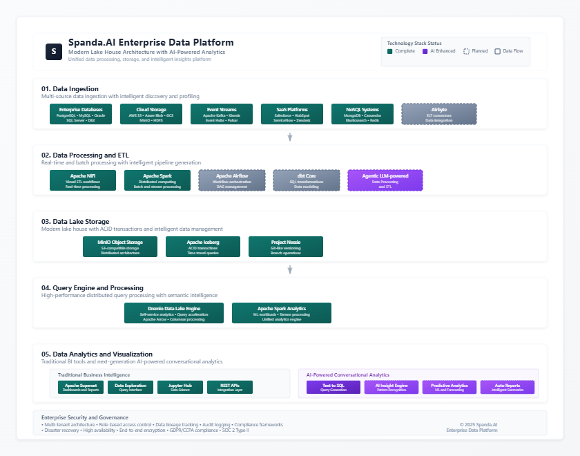

# Spanda.AI Platform - Data Management and Analytics

**Spanda.AI: The Intelligent Data Platform for the AI Era**

Spanda.AI is a next-generation data platform that bridges traditional analytics with modern AI capabilities. Designed for enterprises navigating digital transformation, our solution transforms raw data into actionable intelligence through an integrated suite of technologies.

At its core, Spanda.AI delivers:

1. **Unified Data Management**  
   A single platform combining the flexibility of data lakes with the reliability of data warehouses, powered by open table formats and Git-like version control.

2. **Smart Analytics**  
   From traditional business intelligence to conversational AI interfaces that understand natural language queries - making data accessible to both analysts and business users.

3. **Enterprise-Grade Foundations**  
   Built on proven open-source technologies with enhancements for security, performance and scalability to handle petabyte-scale datasets.

4. **Future-Ready Architecture**  
   Supporting both batch and real-time use cases with seamless integration for machine learning and AI workloads.

What sets Spanda.AI apart is our focus on eliminating the traditional trade-offs between scale and simplicity. Our platform enables:
- Data teams to work more efficiently with automated pipelines and collaborative tooling
- Business users to get answers through intuitive AI interfaces
- Organizations to future-proof their data infrastructure while reducing costs

Whether you're modernizing legacy systems or building new data capabilities, Spanda.AI provides the complete toolkit for the age of AI-driven decision making.

---





**Current Implementation and Planned next steps**:
| Component          | Category                | Status | Notes                         |
| ------------------ | ----------------------- | ------ | ----------------------------- |
| Apache Superset    | BI/Visualization        | ✅      |           -                    |
| Apache Iceberg     | Table Format            | ✅      |           -                    |
| Dremio             | Lakehouse Query Engine  | ✅      |           -                    |
| Apache Spark       | Processing Engine       | ✅      |           -                    |
| MinIO              | Object Storage          | ✅      |           -                    |
| Nessie             | Table Version Control   | ✅      |           -                    |
| **Apache NiFi**    | **Data Ingestion**      | ⬜️     | Drag-and-drop flow management |
| **Apache Kafka**   | **Streaming/Brokering** | ⬜️     | Core for real-time pipelines  |
| **Airbyte**        | **ELT Syncing**         | ⬜️     | Easy sync from SaaS & DBs     |
| **Apache Airflow** | **Orchestration**       | ⬜️     | DAGs for all ETL jobs         |
| **dbt**            | **SQL Transformations** | ⬜️     | Developer-friendly modeling   |


This guides you through setting up a complete data engineering environment that demonstrates the Data Lakehouse architecture. You'll learn how to move data from an operational database (PostgreSQL) to a data lake (MinIO with Apache Iceberg tables managed by Nessie), and then query the data using Dremio and visualize it through Apache Superset.

## Prerequisites

- [Docker](https://www.docker.com/products/docker-desktop/) installed on your machine
- Basic knowledge of SQL and data engineering concepts

## Demo Architecture Overview


**Purpose**: Data storage, analysis, and intelligence.

| Component | Status | Description | Supported Sources |
|-----------|--------|-------------|--------------------|
| **Apache Superset** | Done ✅ | Business intelligence web application. | Connects to databases like PostgreSQL, MySQL, Snowflake, and more. |
| **Iceberg** | Done ✅ | Table format for large analytical datasets. | Works with Spark, Flink, Hive, Dremio, and Presto. |
| **Dremio** | Done ✅ | Data lake engine. | Supports sources like Amazon S3, Azure Data Lake, Google Cloud Storage, HDFS, PostgreSQL, MySQL, MongoDB, Snowflake, and Elasticsearch. |
| **Apache Spark** | Done ✅ | Analytics engine for large-scale data processing. | Works with Hadoop, S3, Delta Lake, Kafka, and JDBC-compatible sources. |
| **MinIO** | Done ✅ | High-performance object storage. | Compatible with Amazon S3 APIs and integrates with Spark, Presto, and Dremio. |
| **Nesse** | Done ✅ | Data processing framework. | Works with various databases and file systems. |

Note: The above stack provides extensive capabilities beyond what's listed, supporting integrations with various data sources.

**Integration Points**: Will provide analytical capabilities across the platform.


This setup demonstrates a modern Data Lakehouse architecture with the following components:

- **PostgreSQL**: Operational database
- **Apache Spark**: Data processing and ETL
- **MinIO**: S3-compatible object storage (data lake)
- **Nessie**: Catalog service for Apache Iceberg tables
- **Dremio**: Data lakehouse platform and query engine
- **Apache Superset**: Business intelligence and visualization tool


## Modules of The Pipeline
### Data Lake Profilles
| Profile Name          | Components                |
| ------------------ | ----------------------- | 
| Data Ingestion   | Spark, Kafka + Zookeeper, Nifi        |
| Data Lake   | Minio, Nessie, Iceberg         | 
| Data Storage   | Postgres         | 
| Data Processing   | Dremio         | 
| Data Analytics   | Superset, Rath         | 
<!-- | Complete Pipeline   | Postgres, Spark, Kafka + Zookeeper, Minio, Nessie, Dremio, Superset         |  -->

For ease of customisation, the pipeline is divided into separate modules for each task
Depending upon your requirements, Visit the `Setup` folder and inside it visit the folder with the name of the specified profile and follow the instructions in the respective Setup.md to complete the installation of the Module

## Setup Instructions
Instructions for Combining the individual modules into a fully functional pipeline
#### 1. Create Docker Compose File

Create a new directory for the project, then create a copy of the `.yml` files of all the required modules 

#### 2. Set Up a network 
Create a new network for communication with other modules of the pipeline and list all networks to check if network properly created
```bash
   docker network create Spanda-Net
   docker network ls
   ```

#### 3. Launch the required applications
Run the script `Launch.sh` inside the `Setup` folder to gat a list of all the applications and select the required applications and open their UI on your browser.

#### 4. Module Specific Readme files
Refer to the Module Specific Readme files to understand how to furthur work on each application

