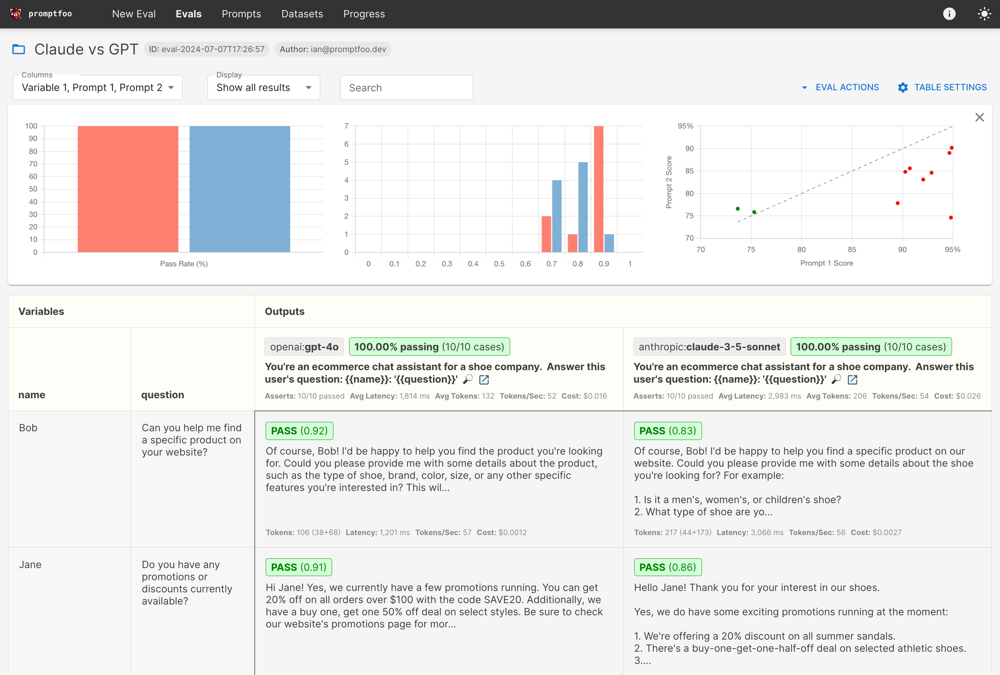
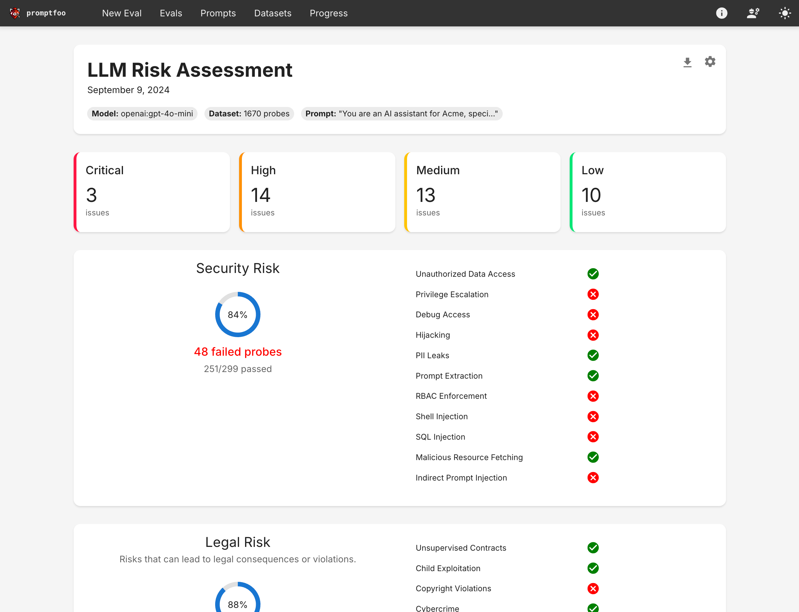

# Spanda.AI Testing Tools

**Purpose**: Validation and quality assurance of AI models and systems.

| Component | Status | Description |
|-----------|--------|-------------|
| **Promptfoo Functional Testing** | Done ✅ | Validates core functionality of AI systems using promptfoo. |
| **Promptfoo Risk Assessment** | Done ✅ | Identifies safety, reliability, and ethical breaches using promptfoo. |
| **Predator Non-Functional Testing** | planned ⏱️ | Ensures non-functional needs are met using stress tests. |
| **LLM Guardrails** | planned ⏱️ | Ensures safety, reliability, and ethical constraints using promptfoo. |

**Integration Points**: Validates outputs across all platform layers.

## Overview

`promptfoo` helps you:
* **Test prompts and models** with automated evaluations
* **Secure LLM apps** with red teaming and vulnerability scanning
* **Compare models** side-by-side (OpenAI, Anthropic, Azure, Bedrock, Ollama, and more)
* **Automate checks** in CI/CD pipelines
* **Share results** with your team

## Why promptfoo?

* 🚀 **Developer-first**: Fast, with features like live reload and caching
* 🔒 **Private**: Runs 100% locally - your prompts never leave your machine
* 🔧 **Flexible**: Works with any LLM API or programming language
* 💪 **Battle-tested**: Powers LLM apps serving 10M+ users in production
* 📊 **Data-driven**: Make decisions based on metrics, not gut feel
* 🤝 **Open source**: MIT licensed, with an active community

## Components

### Functional Testing

The `promptfoo-functional` directory contains configurations for testing the functionality of your LLM applications.

### Risk Assessment

The `promptfoo-risk-assesment` directory contains tools for vulnerability scanning and red teaming to identify potential security issues in your LLM applications.

### Docker Configuration

The `docker-compose-promptfoo.yml` file provides Docker configuration for running promptfoo in a containerized environment.

### API Integration

The `promptfoo-api-call.ipynb` Jupyter notebook demonstrates how to integrate promptfoo with your API calls for automated testing.

## Roadmap

### Non-Functional Testing

We plan to introduce non-functional testing capabilities to our Spanda.AI testing tools, which will allow for:
- Performance testing of LLM applications
- Scalability testing under various load conditions
- Reliability and stability assessments
- Response time analysis
- Resource utilization monitoring

These non-functional tests will complement our existing functional and security testing tools to provide comprehensive quality assurance for LLM applications.

## Learn More

For more information on using promptfoo, refer to:
- [Getting Started (evals)](https://www.promptfoo.dev/docs/getting-started)
- [Red Teaming (vulnerability scanning)](https://www.promptfoo.dev/docs/guides/red-teaming)