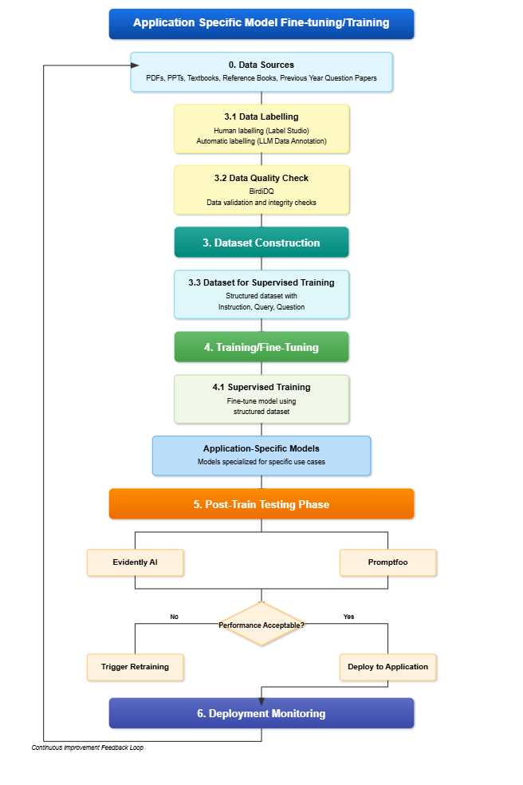

# Application-Specific Model Fine-Tuning/Training Pipeline

This repository provides a structured approach to fine-tuning application-specific models using supervised training. The process ensures continuous improvement through data collection, labeling, validation, training, testing, and deployment monitoring.

## Pipeline Overview

### 1. Data Sources
The pipeline begins by collecting data from various sources:
- PDFs
- PPTs
- Textbooks
- Reference Books
- Previous Year Question Papers

### 2. Data Preparation
#### 2.1 Data Labeling
- **Human Labeling**: Using tools like Label Studio.
- **Automatic Labeling**: Leveraging Large Language Models (LLMs) for data annotation.

#### 2.2 Data Quality Check
To maintain data integrity, **BirdIQC** is used for:
- Data validation
- Integrity checks

### 3. Dataset Construction
A structured dataset is created, including:
- Instructions
- Queries
- Questions

### 4. Training/Fine-Tuning
#### 4.1 Supervised Training
- The structured dataset is used to fine-tune the model.
- The goal is to build **Application-Specific Models** optimized for particular use cases.

### 5. Post-Training Testing
Model performance is evaluated using:
- **Evidently AI**
- **Promptfoo**

#### Decision Process:
- If the performance is **acceptable**, the model is **deployed** to the application.
- If the performance is **not acceptable**, retraining is triggered.

### 6. Deployment & Monitoring
Once deployed, continuous monitoring ensures:
- Model performance is tracked.
- Necessary improvements are identified for iterative enhancements.

---