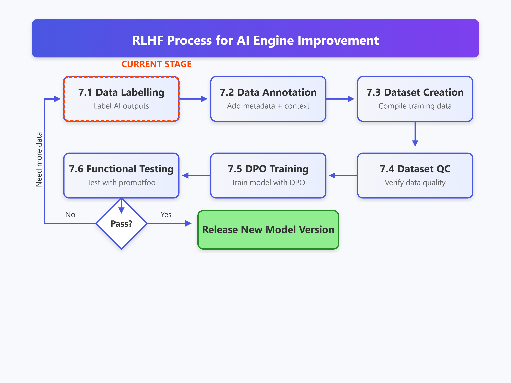

# Reinforcement Learning with Human Feedback (RLHF)

## 1. Reward Model Training
- **Data Collection**: Gathering human-labeled feedback.
- **Training**: Fine-tuning reward models using supervised learning.

## 2. RLHF Fine-tuning
- **Proximal Policy Optimization (PPO)**: Reinforcement learning step for improving responses.
- **Reward Model Optimization**: Adjusting parameters based on human preferences.

## 3. Post-RLHF Evaluation
- **Comparative Analysis**: Evaluating performance improvements.
- **A/B Testing**: Comparing model outputs before and after fine-tuning.

---
