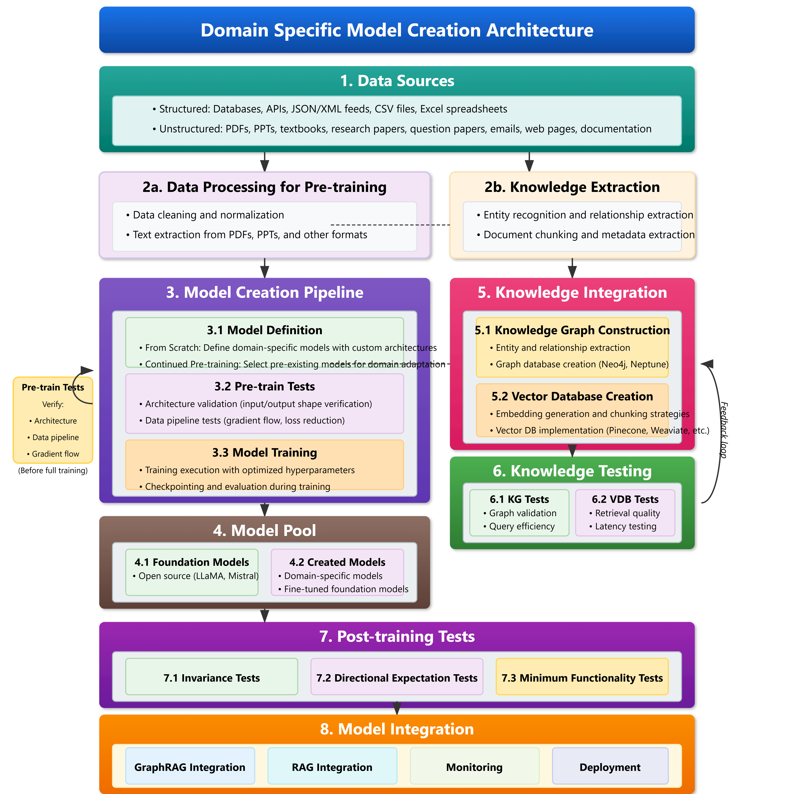

# Domain-Specific Model Creation Pipeline

## 1. Data Sources
Data sources include:
- **Structured Data**: Databases, APIs, JSON/XML feeds, CSV files, Excel spreadsheets.
- **Unstructured Data**: PDFs, PPTs, textbooks, research papers, emails, web pages, documentation.

## 2. Data Processing & Knowledge Extraction

### 2.1 Data Processing for Pre-training
- **Data Cleaning & Normalization**: Removing inconsistencies, ensuring uniform formatting.
- **Text Extraction**: Parsing data from PDFs, PPTs, and other documents.

### 2.2 Knowledge Extraction
- **Entity Recognition & Relationship Extraction**: Identifying key entities and linking relevant data.
- **Document Chunking & Metadata Extraction**: Structuring documents for optimized retrieval.

## 3. Model Creation Pipeline

### 3.1 Model Definition
- **From Scratch**: Designing domain-specific models with custom architectures.
- **Pre-trained Models**: Selecting existing models for domain adaptation and fine-tuning.

### 3.2 Pre-training Validation
- **Architecture Validation**: Ensuring input/output shape compatibility.
- **Data Pipeline Tests**: Verifying gradient flow and loss reduction before full training.

### 3.3 Model Training
- **Hyperparameter Optimization**: Fine-tuning parameters for optimal performance.
- **Checkpointing & Evaluation**: Monitoring training progress and model accuracy.

## 4. Post-training Tests

### 4.1 Invariance Tests
- Ensuring model consistency under various inputs.

### 4.2 Directional Expectation Tests
- Checking expected behavioral patterns.

### 4.3 Minimum Functionality Tests
- Validating core model capabilities.

## 5. Model Pool

### 5.1 Foundation Models
- Open-source models such as LLaMA, Mistral, etc.

### 5.2 Created Models
- Fine-tuned and domain-specific models customized for the use case.

## 6. Model Integration
- **GraphRAG & RAG Integration**: Combining retrieval-augmented generation with structured data.
- **Monitoring & Deployment**: Ensuring stability and performance in production environments.

---
