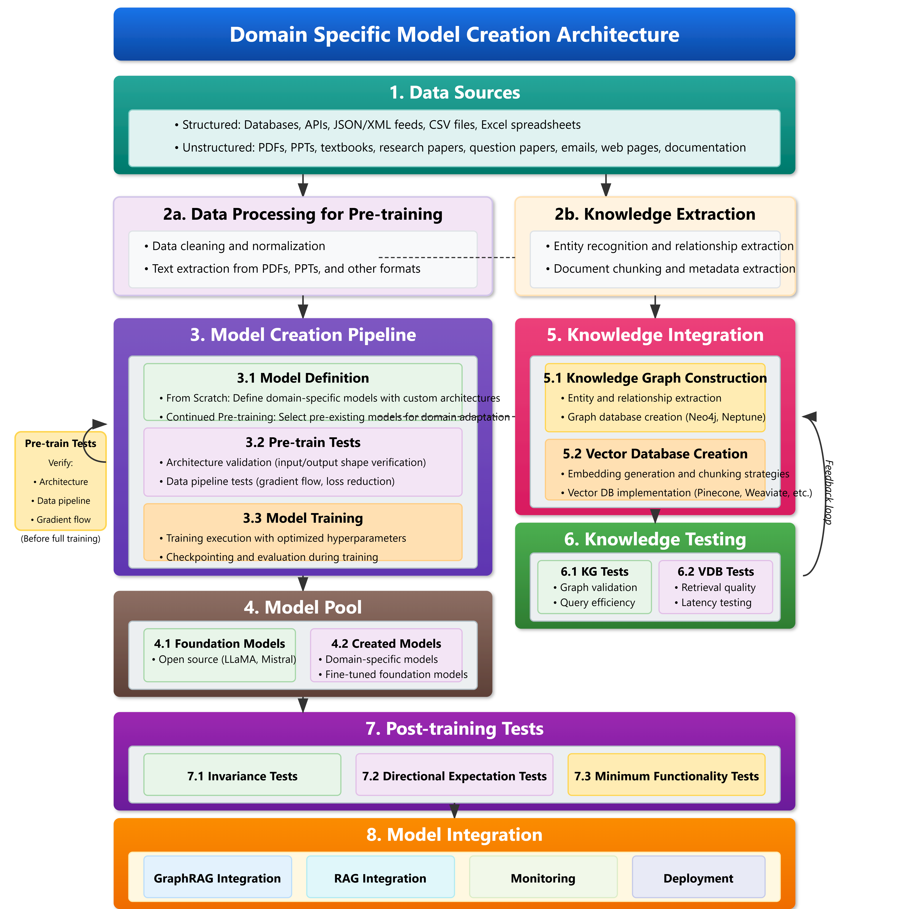
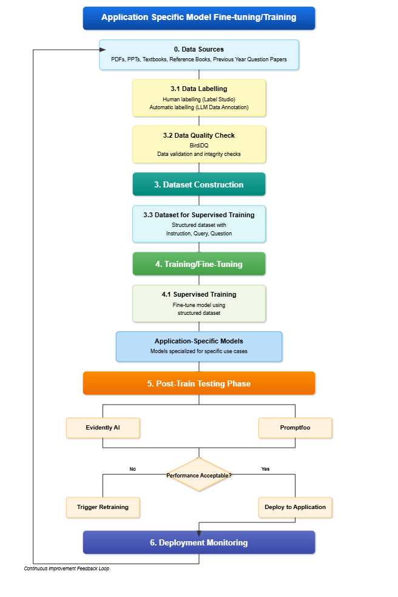
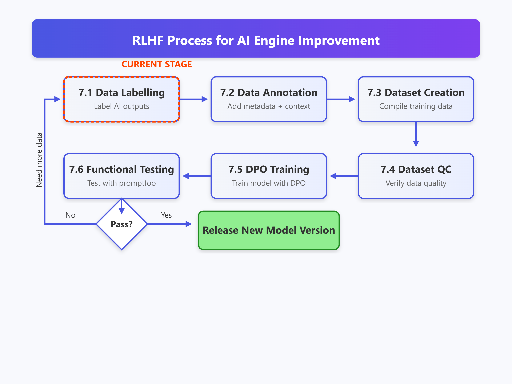

# Model Fine-Tuning & Training Pipeline

## Training Methods Plan

| Training Method                          | Description | Status |
|------------------------------------------|-------------|------------|
| **Decentralized Training**           | In decentralized training, multiple nodes independently train models using their local data and periodically exchange updates with each other to improve performance. This approach eliminates the need for a central server, enabling training to be more robust to failures and reducing communication overhead. It is ideal for scenarios where data privacy is a concern, and computing resources are distributed across multiple devices or edge nodes. |  Planned ⏱️  |
**Federated Learning** | Federated learning involves multiple client devices that locally train models on their own data and then share only the model updates (gradients) with a central server, rather than raw data. This method enhances data privacy and security while still allowing collaborative model training. It is commonly used in environments where data cannot be centralized, such as healthcare and mobile applications.|  Planned ⏱️  |

### Supported Training Methods:

DeepSpeed is supported, thus multi-node is supported aswell. Please look at the fine-tune_and_train dir for more details.

| Training Approach       | Full-Tuning ✅ | Freeze-Tuning ✅ | LoRA ✅ | QLoRA ✅ |
|------------------------|---------------|---------------|---------|---------|
| **Pre-Training**       | ✅             | ✅             | ✅       | ✅       |
| **Supervised Fine-Tuning** | ✅        | ✅             | ✅       | ✅       |
| **Reward Modeling**    | ✅             | ✅             | ✅       | ✅       |
| **PPO Training**       | ✅             | ✅             | ✅       | ✅       |
| **DPO Training**       | ✅             | ✅             | ✅       | ✅       |
| **KTO Training**       | ✅             | ✅             | ✅       | ✅       |
| **ORPO Training**      | ✅             | ✅             | ✅       | ✅       |
| **SimPO Training**     | ✅             | ✅             | ✅       | ✅       |

**Integration Points**: Provides trained models to the Inference component.

## Domain-Specific Model Pipeline

- **Pre-training & Knowledge Extraction**: Cleaning, entity recognition.
- **Model Training**: Foundation & custom models, hyperparameter tuning.
- **Integration**: RAG, GraphRAG, structured/unstructured data.

## Fine-Tuning Workflow

- **Data Collection**: PDFs, PPTs, textbooks, reference materials.
- **Data Preparation**: Labeling (manual & automatic), quality checks.
- **Training**: Supervised fine-tuning for specific applications.
- **Testing & Deployment**: Evaluations using Evidently AI & Promptfoo.

## Reinforcement Learning (RLHF)

- **Reward Model Training**: Learning from human feedback.
- **Optimization**: Using PPO and comparative evaluations.

This document provides a high-level overview of our model development process.

