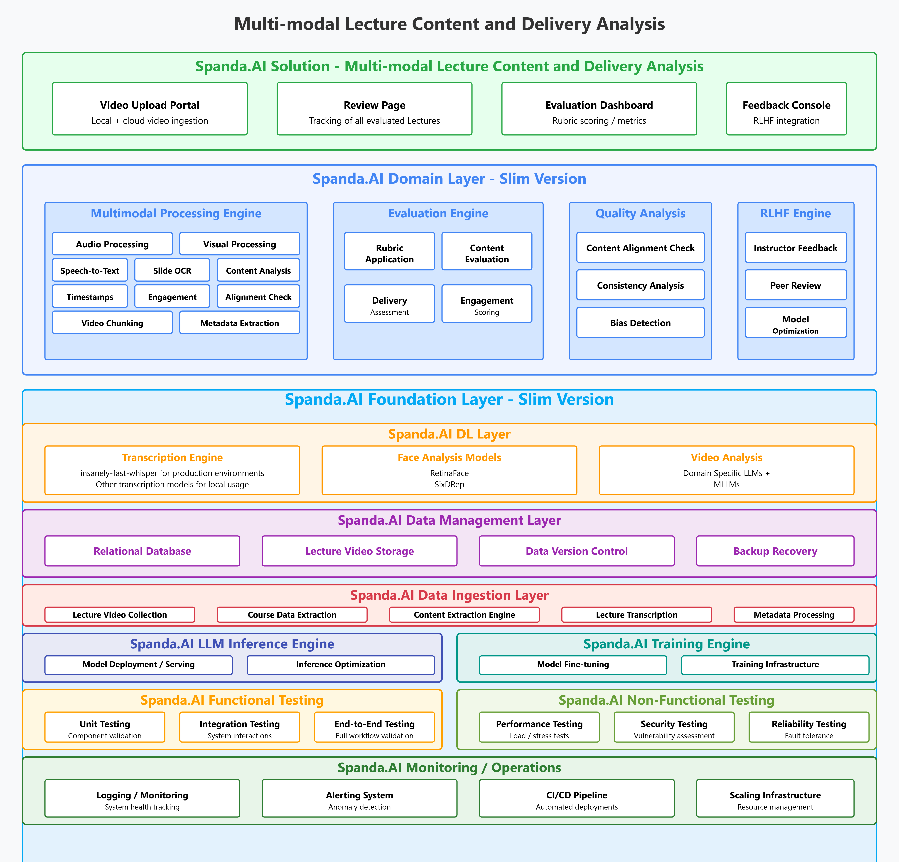
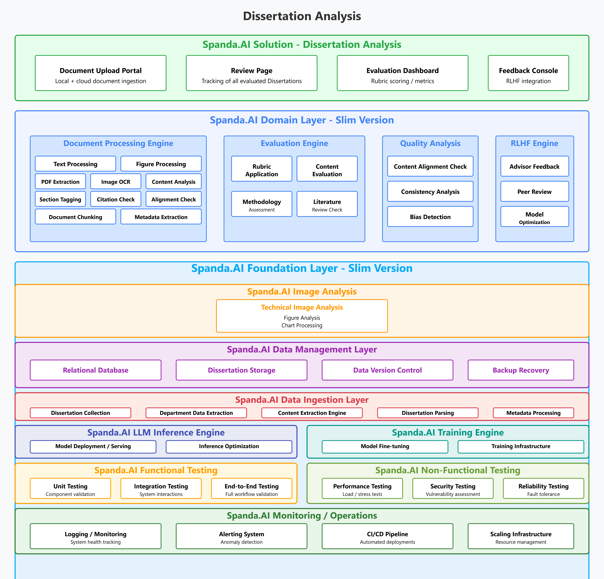
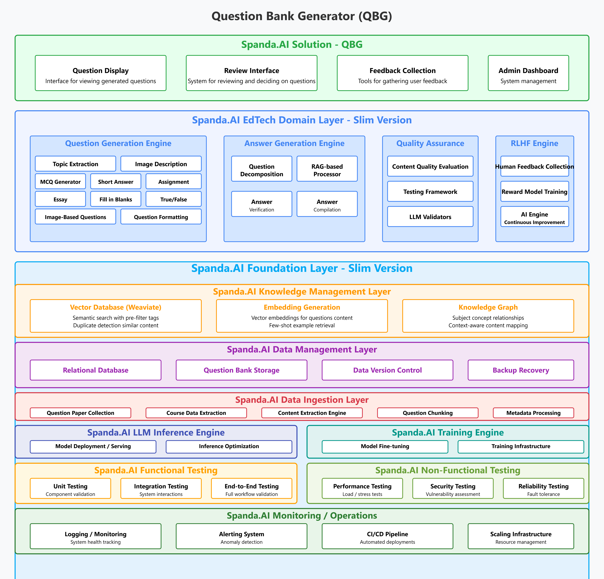

## 🎓 EdTech Domain Solutions

These solutions are part of a broader EdTech framework and are composed of modular, reusable functional blocks such as lecture transcription, semantic analysis, rubric-based grading, and content generation. These components are designed to be flexible and can be easily adapted to a wide range of educational use cases beyond the three showcased here. Whether you're building tools for automated assessment, content personalization, or interactive learning experiences, the foundational blocks provided in this suite offer a strong starting point. The three highlighted examples—Multi-Modal Lecture Content and Delivery Analysis, Dissertation Evaluation, and Question Bank Generator—are fully functional, open-source implementations that demonstrate the potential of what's possible in the EdTech domain.

### 📊 Multi-Modal Lecture Content and Delivery Analysis

A solution designed to analyze lecture delivery using multiple modalities such as audio, visual, and textual data to assess engagement and delivery quality.



---

### 📝 Dissertation Evaluation

An automated framework for evaluating student dissertations using AI-powered semantic understanding and rubric-based grading.



---

### 🧠 Question Bank Generator

Generates a rich and diverse set of questions from curriculum materials, lectures, or textbooks using context-aware AI models.



---

# Kubernetes Cluster Setup

This README provides instructions on how to apply various Kubernetes cluster elements, including deployments, services, config maps, secrets, and Horizontal Pod Autoscalers (HPA).

## Prerequisites

- A working Kubernetes cluster
- `kubectl` installed and configured
- Necessary YAML files for deployments, services, config maps, secrets, and HPA

## Applying Cluster Elements

### 1. Ensure NGINX Ingress Controller is Running
Make sure your NGINX ingress controller for the Kubernetes cluster is running. If you are using Minikube, you can enable it using:

```bash
minikube addons enable ingress
```

Next, navigate to the Kubernetes folder inside the platform repository and apply the ingress manifest file to add ingress rules:

```bash
cd platform/kubernetes
kubectl apply -f ingress.yaml
```

### 2. Apply Platform Components
After ensuring that the ingress controller is running, apply all the platform components you want by navigating through each component's Kubernetes folder and applying the manifest and secret files inside those folders.

For each platform component, follow these steps:

```bash
cd platform/<component>/kubernetes
kubectl apply -f secrets.yml # if present
kubectl apply -f .
```

### 3. Change to the Solution Layer Directory
Before applying any Kubernetes resources, navigate to the solution layer application directory you want to run:

```bash
cd solutions
cd kubernetes
```

Make sure to change the directory path as per your setup.

If a `secrets.yml` file is present, apply it first:

```bash
kubectl apply -f secrets.yml
```

Then, apply all remaining files:

```bash
kubectl apply -f .
```

### 3. Deployments
Deployments manage pod creation and updates. To apply a deployment, use:

```bash
kubectl apply -f deployment.yaml
```

Replace `deployment.yaml` with your actual file path. To check the status:

```bash
kubectl get deployments
kubectl describe deployment <deployment-name>
```

### 4. Services
Services expose your application to the network. To apply a service, use:

```bash
kubectl apply -f service.yaml
```

Check the service status with:

```bash
kubectl get services
kubectl describe service <service-name>
```

### 5. Config Maps
Config maps store configuration data as key-value pairs. Apply a config map with:

```bash
kubectl apply -f configmap.yaml
```

View the config map details:

```bash
kubectl get configmaps
kubectl describe configmap <configmap-name>
```

### 6. Secrets
Secrets are used to store sensitive information securely. Apply a secret using:

```bash
kubectl apply -f secret.yaml
```

Verify the secret:

```bash
kubectl get secrets
kubectl describe secret <secret-name>
```

## Troubleshooting
If any resources fail to apply or update, check the logs with:

```bash
kubectl logs <pod-name>
```

To view all cluster resources:

```bash
kubectl get all
```

For more detailed output, use the `-o yaml` or `-o wide` flags.

## Cleanup
To delete applied resources, use:

```bash
kubectl delete -f <resource-file.yaml>
```

Or delete all resources from a specific namespace:

```bash
kubectl delete all --all -n <namespace>
```

## Conclusion
Following these instructions ensures a smooth application of Kubernetes cluster elements. Feel free to customize the YAML files according to your specific requirements.

